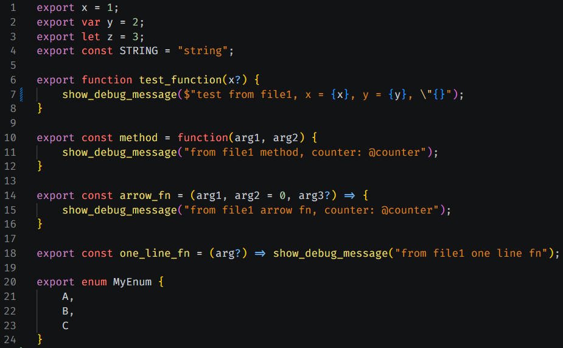
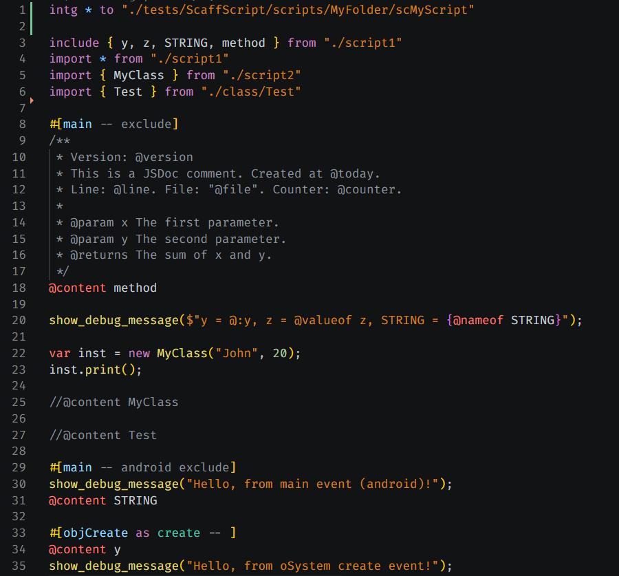

# ScaffScript — VS Code Extension

**ScaffScript** is a minimal **superset of GML (GameMaker Language)** that adds a TypeScript-like module system. Write organized, modular GML in `.ss` files. **ScaffScript** compiles to GML and can inject it directly into your GameMaker project.

This extension provides **language support for `.ss` files** inside Visual Studio Code.

> **DISCLAIMER:** ScaffScript is **not** affiliated with or endorsed by YoYo Games Ltd. GameMaker and GML are trademarks of YoYo Games Ltd. This is an independent community effort.


## Features

Full syntax highlighting for `.ss` (ScaffScript) files, covering:

- **Module system keywords**

    `export`, `import`, `include`, `intg`, `from`, `to`, `as`, `export ... from`.

- **GML & control flow keywords**

    `if`, `else`, `for`, `while`, `return`, `switch`, `try`, `catch`, and more.

- **Storage types**

    `var`, `let`, `const`, `function`, `class`, `interface`, `enum`, `type`, `extends`.

- **Content directives**

    `@content`, `@valueof`, `@typeof`, `@nameof`, `@use`, and inline aliases (`@:name`).

- **Integration blocks** 

    `#[blockName]`, `#[blockName as EventType]`, `#[EventType:EventSubtype Event]`, flags after `--`.

- **Classes, interfaces, enums, and types**, with proper scope colorization.

- **Strings**

    Double-quoted, single-quoted, template literals (`` ` ``), GML template strings (`$"..."`), and raw strings (`@"..."`).

- **Comments**

    `//` line comments and `/* */` block comments.





Additional editor niceties:
- Auto-closing pairs for `{}`, `[]`, `()`, `""`, `''`, and `` `` ``.
- Bracket matching and surrounding pairs.
- Smart indentation rules.


## Installation

### From the VS Code Marketplace

1. Open VS Code.
2. Go to the **Extensions** panel (`Ctrl+Shift+X` / `Cmd+Shift+X`).
3. Search for **ScaffScript**.
4. Click **Install**.

<!--### From a VSIX file

1. Download the `.vsix` file from the [Releases](https://github.com/undervolta/scaffscript-vscode/releases) page.
2. In VS Code, open the Command Palette (`Ctrl+Shift+P` / `Cmd+Shift+P`).
3. Run **Extensions: Install from VSIX…**.
4. Select the downloaded `.vsix` file.-->


## Usage

Once installed, any file with a `.ss` extension will automatically be recognized as **ScaffScript** and syntax highlighting will activate.

Here's a quick taste of what ScaffScript looks like:

```ts
// src/index.ss
intg { main } to "./scripts/Libraries/MyLib"

import * from "./utils"

#[main]
include { helper } from "./helpers"
@content helper

export function myLib_get(key) {
    return helper(key);
}
```

For a full guide on the ScaffScript language itself, check out the **[official documentation](https://scaffscript.lefinitas.com)**.


## Limitations

- **Syntax highlighting only**
    
    There's no IntelliSense, code completion, hover info, go-to-definition, or error diagnostics yet. This extension is purely a grammar/language definition for now.

- **Regex-based parser** 
    
    **ScaffScript**'s compiler uses a regex-based parser (not an AST), so nested code blocks (e.g. nested struct literals in `@use` directives) and some edge cases may not parse correctly.

- **GameMaker 2.3+ only**
    
    **ScaffScript** is designed and tested for **GameMaker 2.3+**. It may or may not work with GameMaker 1.x.

- **Early development** 

    **ScaffScript** API is subject to change without notice. Use at your own risk.


## Issues

Found a bug or want to request a feature? Open an issue on the [GitHub repository](https://github.com/undervolta/scaffscript-vscode/issues).

When reporting a bug, please include:
- Your VS Code version.
- The extension version.
- A minimal code snippet that reproduces the issue.
- A screenshot or description of what you expected vs what happened.


## More Info

- 📖 [ScaffScript Documentation](https://scaffscript.lefinitas.com)
- 💬 [Discord Server](https://discord.gg/pBrRGSXU96)
- ⭐ [ScaffScript Core Repository](https://github.com/undervolta/scaffscript)
